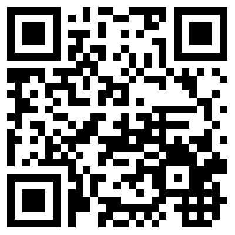

# Aufzugswächter Android App

Android app for the [Aufzugswaechter.org](http://www.aufzugswaechter.org).

[Download the latest APK](https://github.com/highsource/aufzugswaechter-android-app/releases/download/1.0.1/aufzugswaechter-1.0.1.apk).

# Installation

This is an early prototype, so you'll need to activate installation of apps from unknown sources on your Android device:

* Go to `Settings`
* Select `Security`
* Check `Unknown sources` > `Allow installation of apps from sources other than the Play Store`
* Click `OK`
* 
# Usage

## Map

## Markers

TBD

## Scanning the QR-Code

You can select a facility by scanning a QR code.

* Click the QR-Code scan in the toolbar
* Scan a QR-Code
* The map will navigate to the facility and open the info window where you can subscribe to or unsubscribe from updates

The QR-Code may be any string ending with `#<facilityEquipmentnumber>`. For instance, the following image encodes the URL `http://www.aufzugswaechter.org/#10213788` and will take you to the facility with the equipment number `10213788` (`Armdstadt Hbf: Aufzug zu Bstg 2/3`).

## Notifications

## Toogle facility subscription

* Open the facility info window
  * Either click on one of the facility markers on the map
  * Or scan a QR-Code of the facility
* Click and hold the info window until it disappears
* A short `Subscribed` or `Unsubscribed` notice will apear in the botton of the screen

## Unsubscribe from all updates

## Subscribe to all updates

**Don't do this, this is for development only.**
